# ☕ Generation Java Bootcamp

<div align="center">


[](https://www.java.com/)
[](https://mexico.generation.org/)
[]()
[]()
[]()

</div>

## 🎯 Sobre el Bootcamp Generation

**Generation** es un programa intensivo de desarrollo de software que transforma vidas a través de la tecnología. Este repositorio documenta mi progreso diario en el aprendizaje de Java y desarrollo Full Stack.

<div align="center">

```mermaid
graph TB
    A[🚀 Generation Bootcamp] --> B[☕ Java Fundamentals]
    A --> C[🌐 Web Development]
    A --> D[🗄️ Database Management]
    A --> E[🏗️ Software Architecture]
    
    B --> B1[Sintaxis y Variables]
    B --> B2[POO y Herencia]
    B --> B3[Collections y Streams]
    B --> B4[Exception Handling]
    
    C --> C1[HTML/CSS/JS]
    C --> C2[Spring Boot]
    C --> C3[REST APIs]
    C --> C4[Frontend Frameworks]
    
    D --> D1[SQL y MySQL]
    D --> D2[JPA/Hibernate]
    D --> D3[Database Design]
    
    E --> E1[Design Patterns]
    E --> E2[Testing]
    E --> E3[Deployment]
    
    style A fill:#FF6B35,stroke:#E55A2B,stroke-width:3px,color:#fff
    style B fill:#ED8B00,stroke:#D17500,stroke-width:2px,color:#fff
    style C fill:#4CAF50,stroke:#45A049,stroke-width:2px,color:#fff
    style D fill:#2196F3,stroke:#1976D2,stroke-width:2px,color:#fff
    style E fill:#9C27B0,stroke:#7B1FA2,stroke-width:2px,color:#fff
```

</div>

## 📊 Mi Progreso en el Bootcamp

<div align="center">

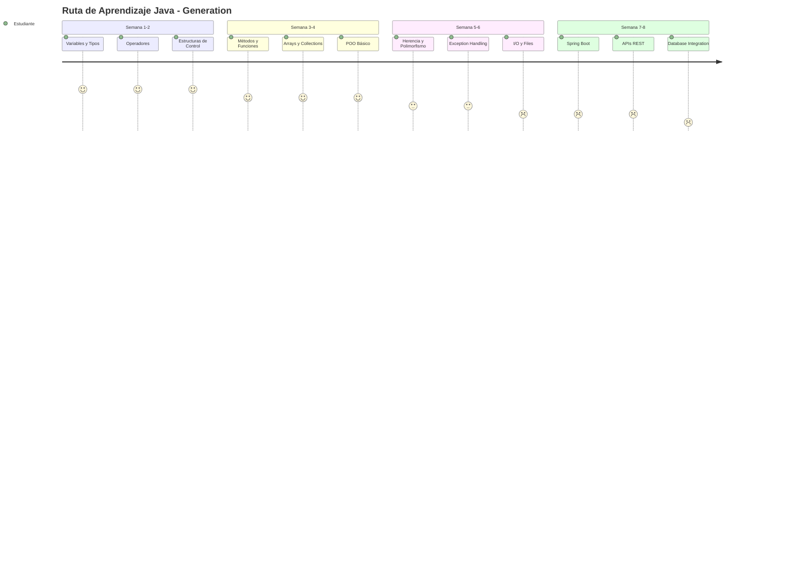

</div>

### 🏆 Objetivos del Bootcamp

<table>
<tr>
<td width="50%">

### 🎓 Técnicos
- ✅ Dominar Java fundamentals
- ✅ Implementar POO correctamente
- 🔄 Desarrollar APIs REST
- 🔄 Manejar bases de datos
- ⏳ Deploy de aplicaciones
- ⏳ Testing automatizado

</td>
<td width="50%">

### 💼 Profesionales
- ✅ Trabajo en equipo
- ✅ Metodologías ágiles
- 🔄 Code review
- 🔄 Documentación técnica
- ⏳ Soft skills
- ⏳ Portfolio completo

</td>
</tr>
</table>

## 📚 Estructura del Repositorio

<div align="center">

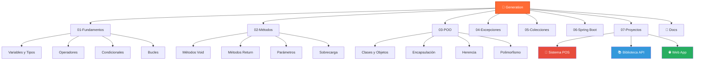

</div>

## 🗂️ Contenido Detallado

### 📂 01-Fundamentos ✅

<div align="center">

| Tema | Archivos | Estado | Dificultad |
|------|----------|--------|------------|
|  | `Variables.java` | ✅ | ⭐ |
|  | 4 archivos | ✅ | ⭐⭐ |
|  | 7 archivos | ✅ | ⭐⭐ |
|  | 5 archivos | ✅ | ⭐⭐ |
|  | 4 archivos | ✅ | ⭐⭐ |

</div>

### 📂 02-Métodos 🔄

<div align="center">

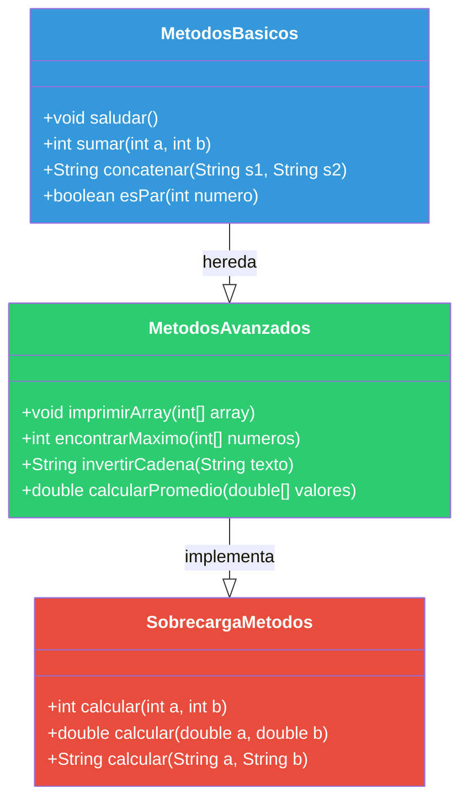

</div>

### 📂 03-POO 🔄

```java
// 🏗️ Ejemplo de clase básica
public class Persona {
    // 🔒 Atributos privados (Encapsulación)
    private String nombre;
    private int edad;
    private String email;
    
    // 🏗️ Constructor
    public Persona(String nombre, int edad, String email) {
        this.nombre = nombre;
        this.edad = edad;
        this.email = email;
    }
    
    // 📖 Getters y Setters
    public String getNombre() { return nombre; }
    public void setNombre(String nombre) { this.nombre = nombre; }
    
    // 🎭 Métodos
    public void presentarse() {
        System.out.println("Hola, soy " + nombre + " y tengo " + edad + " años");
    }
    
    // 🔄 Override toString
    @Override
    public String toString() {
        return "Persona{nombre='" + nombre + "', edad=" + edad + "}";
    }
}
```

### 📂 04-Excepciones ⏳

<div align="center">

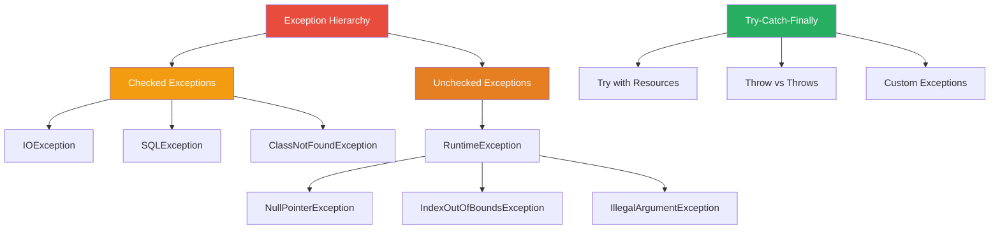

</div>

## 🚀 Quick Start

### 📋 Prerequisitos

<div align="center">

| Herramienta | Versión | Link | Estado |
|-------------|---------|------|--------|
|  | 17+ | [Descargar](https://www.oracle.com/java/technologies/downloads/) | ✅ |
|  | 2024+ | [Descargar](https://www.jetbrains.com/idea/) | ✅ |
|  | Latest | [Descargar](https://git-scm.com/) | ✅ |
|  | 3.8+ | [Descargar](https://maven.apache.org/) | ✅ |

</div>

### ⚡ Configuración Rápida

```bash
# 1️⃣ Clonar el repositorio
git clone https://github.com/Arkanabytes/Generation.git

# 2️⃣ Navegar al directorio
cd Generation

# 3️⃣ Verificar instalación Java
java -version
javac -version

# 4️⃣ Compilar un ejemplo
javac 01-fundamentos/operadores/Operadores.java

# 5️⃣ Ejecutar el programa
cd 01-fundamentos/operadores
java Operadores

# 6️⃣ ¡Listo para explorar! 🎉
```

## 📊 Estadísticas del Progreso

<div align="center">


</div>

### 📈 Métricas de Aprendizaje

<div align="center">

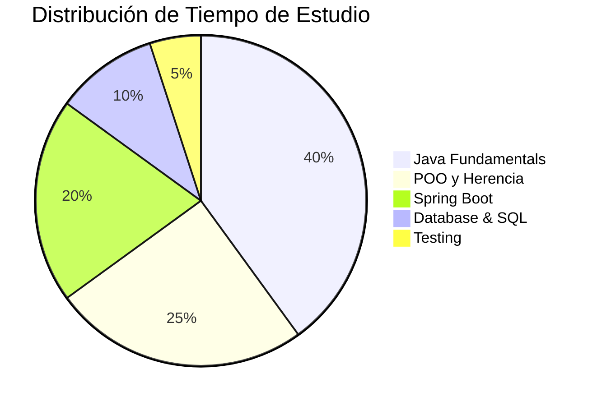

</div>

### 🏅 Logros Desbloqueados

<div align="center">

| Logro | Descripción | Fecha | XP |
|-------|-------------|-------|-----|
| 🏆 **Java Newbie** | Primer "Hello World" | Semana 1 | +100 |
| 🔥 **Loop Master** | 50 ejercicios de bucles | Semana 2 | +250 |
| 🎯 **OOP Warrior** | Primera clase creada | Semana 3 | +300 |
| 📚 **Collection Expert** | Dominando ArrayList | Semana 4 | +400 |
| 🛠️ **Method Maestro** | 100 métodos creados | Semana 5 | +500 |
| 🌟 **Exception Handler** | Try-catch sin errores | Semana 6 | +600 |

</div>

## 🎮 Proyectos del Bootcamp

### 🏪 Proyecto 1: Sistema POS (Point of Sale)

<div align="center">

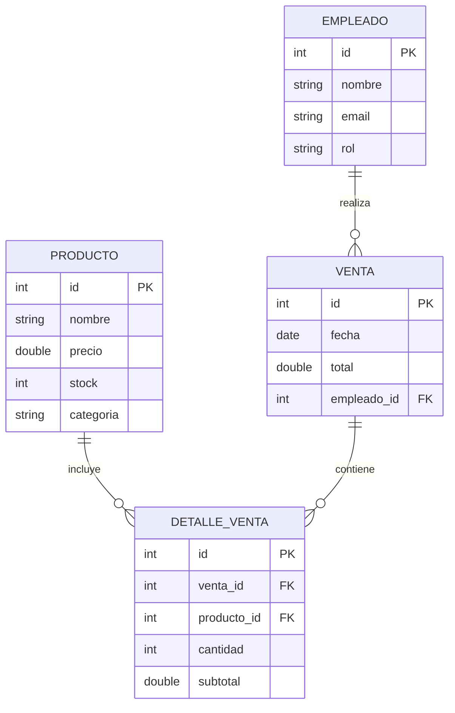

</div>

**Características:**
- ✅ Gestión de productos e inventario
- ✅ Procesamiento de ventas
- ✅ Reportes de ventas diarias
- 🔄 Interfaz gráfica con Swing
- ⏳ Conexión a base de datos

### 📚 Proyecto 2: API REST - Sistema Biblioteca

```java
@RestController
@RequestMapping("/api/libros")
public class LibroController {
    
    @Autowired
    private LibroService libroService;
    
    @GetMapping
    public ResponseEntity<List<Libro>> obtenerTodos() {
        return ResponseEntity.ok(libroService.obtenerTodos());
    }
    
    @PostMapping
    public ResponseEntity<Libro> crear(@RequestBody Libro libro) {
        Libro nuevoLibro = libroService.guardar(libro);
        return ResponseEntity.status(HttpStatus.CREATED).body(nuevoLibro);
    }
    
    @PutMapping("/{id}")
    public ResponseEntity<Libro> actualizar(
        @PathVariable Long id, 
        @RequestBody Libro libro
    ) {
        return ResponseEntity.ok(libroService.actualizar(id, libro));
    }
}
```

### 🌐 Proyecto 3: Aplicación Web Full Stack

<div align="center">

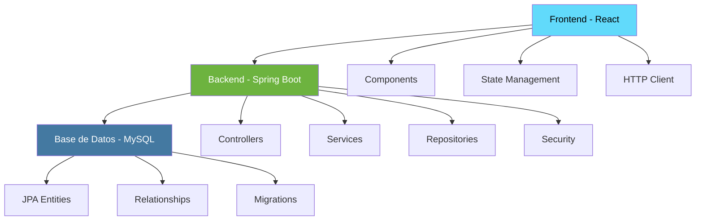

</div>

## 🧪 Testing y Calidad de Código

<div align="center">


</div>

### 🔧 Ejemplo de Test Unitario

```java
@Test
@DisplayName("Debería calcular el área de un rectángulo correctamente")
void deberiaCalcularAreaRectangulo() {
    // Given - Arrange
    Rectangulo rectangulo = new Rectangulo(5.0, 3.0);
    double esperado = 15.0;
    
    // When - Act
    double resultado = rectangulo.calcularArea();
    
    // Then - Assert
    assertEquals(esperado, resultado, 0.001);
    assertTrue(resultado > 0);
    assertNotNull(rectangulo);
}

@ParameterizedTest
@ValueSource(ints = {2, 4, 6, 8, 10})
@DisplayName("Debería identificar números pares correctamente")
void deberiaIdentificarNumerosPares(int numero) {
    assertTrue(NumeroUtils.esPar(numero));
}
```

## 📅 Cronograma del Bootcamp

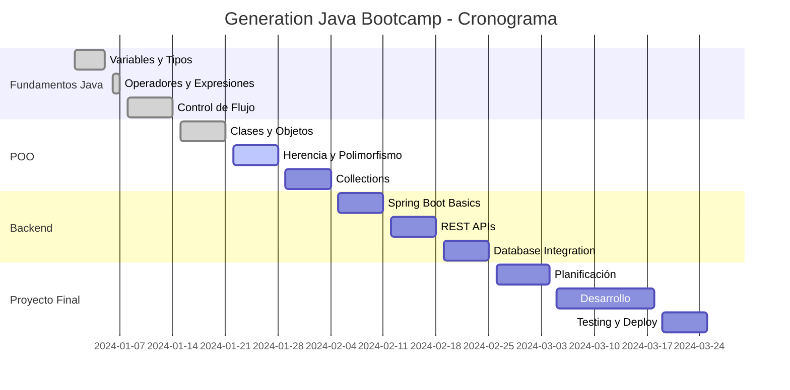

## 🌟 Filosofía Generation

<div align="center">

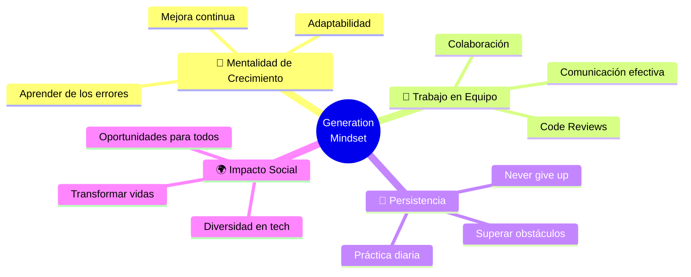

</div>

### 💡 Valores del Programa

<table>
<tr>
<td width="25%" align="center">

### 🎯 **Mentalidad de Crecimiento**
*"Los desafíos son oportunidades de aprender"*

</td>
<td width="25%" align="center">

### 🤝 **Colaboración**
*"Juntos llegamos más lejos"*

</td>
<td width="25%" align="center">

### 💪 **Persistencia**
*"El éxito requiere constancia"*

</td>
<td width="25%" align="center">

### 🌟 **Excelencia**
*"Siempre dando lo mejor"*

</td>
</tr>
</table>

## 🛠️ Herramientas y Tecnologías

### 💻 Stack de Desarrollo

<div align="center">

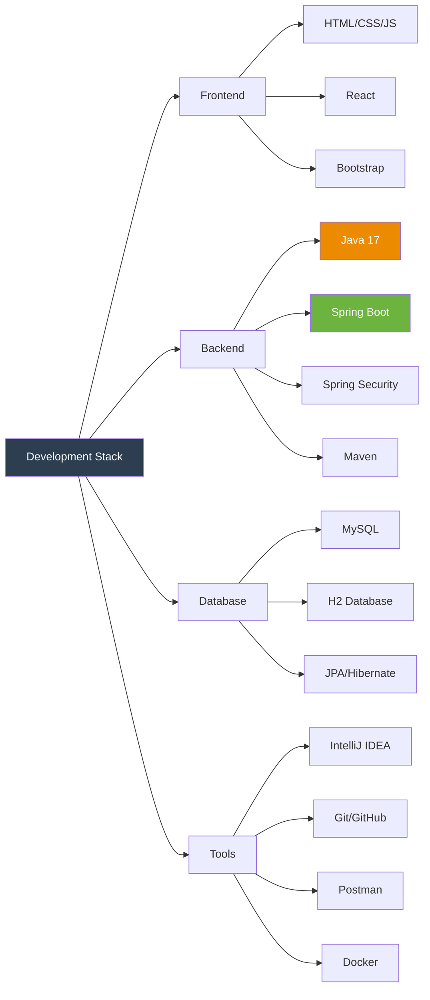

</div>

### 📚 Recursos de Aprendizaje

<div align="center">

| Categoría | Recurso | Tipo | Rating |
|-----------|---------|------|--------|
| 📖 | [Oracle Java Docs](https://docs.oracle.com/en/java/) | Documentación | ⭐⭐⭐⭐⭐ |
| 🎥 | [Java Brains YouTube](https://www.youtube.com/channel/UCYt1sfh5464XaDBH0oH_o7Q) | Videos | ⭐⭐⭐⭐⭐ |
| 📚 | [Effective Java](https://www.oreilly.com/library/view/effective-java-3rd/9780134686097/) | Libro | ⭐⭐⭐⭐⭐ |
| 💻 | [LeetCode Java](https://leetcode.com/) | Práctica | ⭐⭐⭐⭐ |
| 🏆 | [HackerRank Java](https://www.hackerrank.com/domains/java) | Challenges | ⭐⭐⭐⭐ |

</div>

## 🏆 Certificaciones y Logros

<div align="center">


</div>

### 🎯 Metas de Certificación

- [ ] 🥇 Oracle Certified Associate (OCA) Java SE 11
- [ ] 🥈 Oracle Certified Professional (OCP) Java SE 11  
- [ ] 🥉 Spring Professional Certification
- [ ] 🏅 AWS Certified Developer Associate

## 🤝 Comunidad Generation

<div align="center">

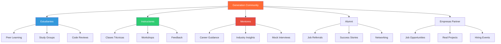

</div>

## 📈 Progreso Personal

### 🎯 Objetivos SMART

<table>
<tr>
<td width="50%">

### 📅 Corto Plazo (1-3 meses)
- ✅ Completar módulo de Java fundamentals
- ✅ Crear primera aplicación POO
- 🔄 Desarrollar API REST funcional
- ⏳ Dominar Spring Boot básico
- ⏳ Completar proyecto de biblioteca

</td>
<td width="50%">

### 🚀 Largo Plazo (6-12 meses)
- ⏳ Obtener certificación Oracle Java
- ⏳ Conseguir trabajo como Java Developer
- ⏳ Contribuir a proyectos open source
- ⏳ Crear portfolio completo
- ⏳ Mentorear a nuevos estudiantes

</td>
</tr>
</table>

### 📊 Tracking Semanal

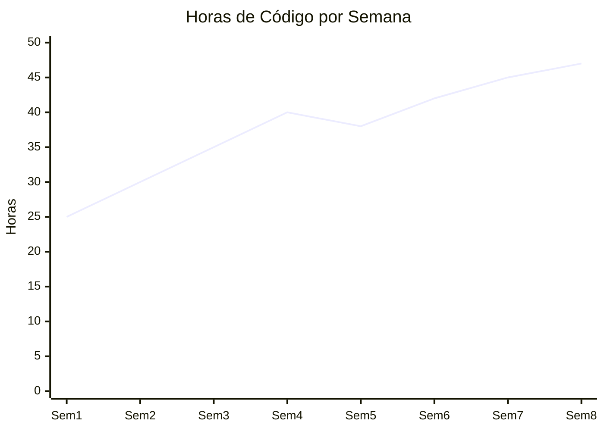

## 🎓 Testimonial

> *"Generation ha transformado completamente mi perspectiva sobre la programación. No solo aprendí Java, sino que desarrollé una mentalidad de crecimiento que me permite enfrentar cualquier desafío técnico con confianza."*
> 
> **- Mi experiencia en Generation** ⭐⭐⭐⭐⭐

## 📞 Contacto y Networking

<div align="center">


**Consuelo Alejandra Pinto Toro**  
*Java Full Stack Developer in Training*

[](https://github.com/Arkanabytes)
[](https://www.linkedin.com/in/consuelo-alejandra-pinto-toro/)
[](mailto:konshuelo@hotmail.com)
[](https://mexico.generation.org/)

</div>

## 🌟 Agradecimientos

<div align="center">

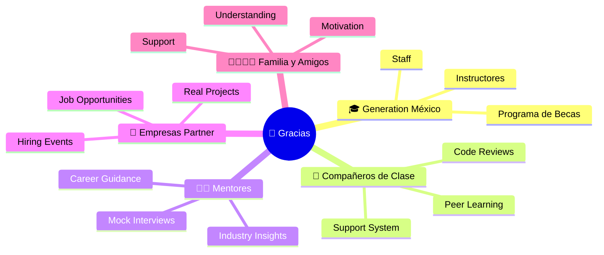

</div>

---

<div align="center">


### 💪 *"Every expert was once a beginner. Every pro was once an amateur."*

[
